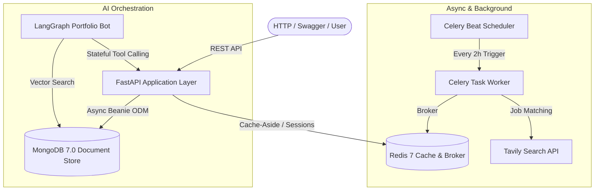

# NovaGates Backend & AI Developer Onboarding

[](https://www.python.org/)
[](https://fastapi.tiangolo.com/)
[](https://www.mongodb.com/)
[](https://redis.io/)
[](https://www.docker.com/)
[](https://github.com/astral-sh/ruff)

This repository contains the structured deliverables, local infrastructure orchestration, query notebooks, and seed project scaffolds for the **NovaGates 2-Week Backend & AI Developer Programme**.

---

## System Architecture



---

## Quickstart

We provide a PowerShell task runner [`run.ps1`](run.ps1) and standard [`Makefile`](Makefile) for consistent developer workflow.

### 1. Start Infrastructure
```powershell
# Windows PowerShell
.\run.ps1 up

# Linux / macOS
make up
```

### 2. Seed Database & Provision Indexes
```powershell
.\run.ps1 seed
```
Seeds collections (`skills`, `projects`, `experiences`) and provisions unique, compound, and weighted text indexes.

### 3. Run End-to-End Smoke Verification
```powershell
.\run.ps1 verify
```
Executes checks across Docker, MongoDB aggregation pipelines, text search scoring, and Redis TTL / FIFO queues.

### 4. Code Quality & Linting
```powershell
.\run.ps1 lint
.\run.ps1 format
```

---

## Repository Layout

```text
d:/Work-orientation/
├── .vscode/                     # Team-standard IDE configurations
│   ├── extensions.json          # Recommended VS Code plugins
│   └── settings.json            # Auto-formatting (Ruff / Black)
├── app/                         # Production FastAPI + Beanie Layered Architecture
│   ├── api/v1/                  # Routers: /skills, /projects, /experiences, /jobs, /ai, /health, /agent
│   ├── core/                    # Config (pydantic-settings), db_init, cache, exceptions
│   ├── models/                  # Beanie Document models (Project, Skill, Experience)
│   ├── repositories/            # Generic BaseRepository & Domain Repositories
│   ├── schemas/                 # Pydantic v2 Request & Response models
│   ├── services/                # Business logic, Redis caching, Ollama Cloud & Tavily
│   └── main.py                  # Lifespan application factory & static mount
├── static/                      # Interactive client portal (HTML, CSS, JS)
├── tests/                       # Automated pytest suite (HTTPX async test client)
├── deliverables/                # Curriculum deliverables & milestones
│   ├── day1_environment_check.py# Environment diagnostic script
│   ├── sample_seed_data.json    # Reference domain dataset
│   ├── seed_database.py         # Production database seeder & indexer
│   ├── verify_all.py            # End-to-end infrastructure smoke test
│   ├── mongodb_queries.ipynb    # Milestone: Interactive MongoDB Jupyter Notebook
│   ├── mongodb_queries.md       # Milestone: Documented MongoDB query catalogue
│   └── redis_caching_guide.md   # Day 4/5 Redis & Caching reference architecture
├── docker-compose.yml           # Container orchestration (MongoDB 7 & Redis 7)
├── pyproject.toml               # Project metadata & Ruff/pytest configurations
├── .env.example                 # Production configuration blueprint
├── run.ps1                      # PowerShell developer automation script
├── Makefile                     # Cross-platform developer automation
└── README.md                    # System documentation
```

---

## Curriculum Milestones & Progress

- [x] **Day 1: Setup & Onboarding** — Tooling validated (Python, `uv`, Git, Docker Desktop).
- [x] **Day 2–3: MongoDB Foundations** — CRUD, filtering, compound indexing, query plans (`explain`), multi-stage aggregations (`$lookup`, `$unwind`), text search, and Atlas vector search.
- [x] **Day 4–5: Redis & Caching** — CLI patterns, TTL invalidation, Cache-Aside pattern, and distributed locking.
- [x] **Day 5–6: Seed Project Scaffold & Core Logic** — FastAPI layered architecture with Beanie ODM, Redis cache, Tavily job search, and Ollama Cloud integration.
- [x] **Day 6–7: Celery & Tavily Job Retrieval Worker** — Background Celery worker process with 2-hour periodic Beat scheduler & API trigger (`POST /api/v1/jobs/sync-task`).
- [x] **Day 7: Full Stack Containerisation** — Multi-stage Dockerfile and full stack compose orchestrating `api`, `mongodb`, `redis`, `celery_worker`, and `celery_beat`.
- [x] **Day 8–10: LangGraph Portfolio Agent** — Conversational agent with stateful `MemorySaver` checkpointer, tool calling, and FastAPI endpoint (`POST /api/v1/agent/chat`).

---

## Live API Endpoints Reference

| Method | Endpoint | Description |
| :--- | :--- | :--- |
| `GET` | `/` | Interactive Client Portal |
| `GET` | `/docs` | Interactive Swagger UI API documentation |
| `GET` | `/api/v1/health` | Liveness probe returning service metadata |
| `GET` | `/api/v1/health/ready` | Readiness probe verifying MongoDB & Redis connections |
| `GET` | `/api/v1/skills` | List all skills (Redis cached, O(1) response time) |
| `POST`| `/api/v1/skills` | Create a new skill (automatically invalidates cache) |
| `GET` | `/api/v1/projects` | List projects (supports `?featured=true` and `?q=search`) |
| `GET` | `/api/v1/projects/{id}/detail` | Project detail with dynamically populated referenced skills |
| `POST`| `/api/v1/jobs/match` | Direct live job search via Tavily matching top skills |
| `POST`| `/api/v1/jobs/sync-task` | Dispatch asynchronous 2-hour job sync to Celery worker |
| `POST`| `/api/v1/ai/bio` | Executive developer pitch generated via Ollama Cloud |
| `POST`| `/api/v1/agent/chat` | Stateful conversational LangGraph agent with MongoDB tool calling |

---

## Testing & Validation Standards

1. `python deliverables/verify_all.py` passes with **0 failures**.
2. Python code adheres to PEP 8 / PEP 604 and passes `ruff check .`.
3. Unit and integration tests cover both happy paths and edge cases.
