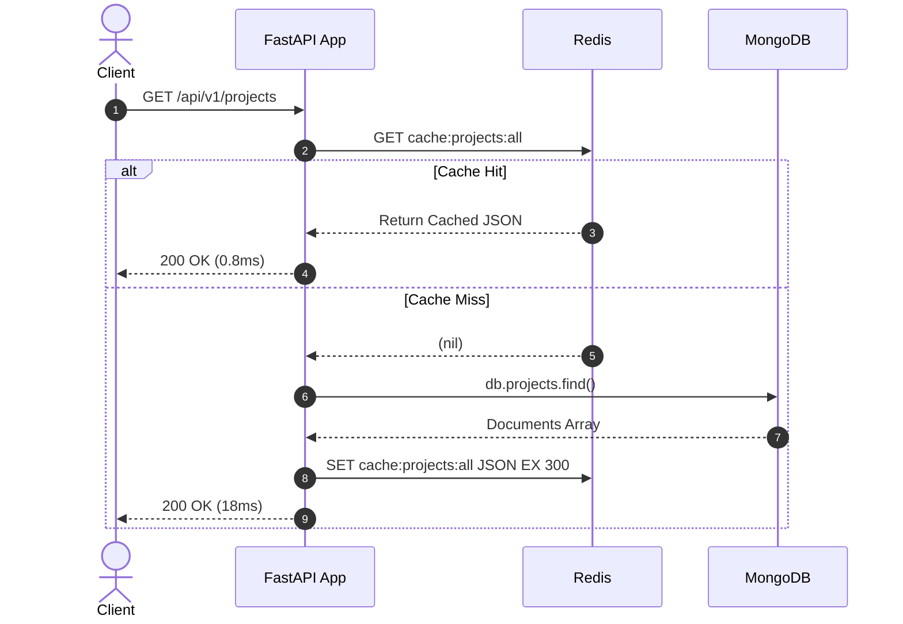

# NovaGates Backend & AI — Day 4/5 Caching & Redis Architecture Guide
**Author:** Backend & AI Engineering  
**Scope:** Distributed Caching, Celery Brokerage, TTL Invalidation, and High-Throughput Patterns  
**Reference Container:** `novagates-redis` (`redis:7-alpine`) on port `6379`

---

## 1. Executive Summary & Architectural Role

In the NovaGates backend architecture, Redis serves 4 mission-critical roles:
1. **L1 In-Memory Read Cache:** Reduces latency on high-frequency MongoDB queries (e.g. portfolio profiles, skills list) from ~15ms to <1ms.
2. **Celery Task Broker & Result Backend:** Powers asynchronous background workers (e.g., periodic Tavily job search runs on DB 1 & DB 2).
3. **Distributed Rate Limiter & Mutex:** Guarantees atomic operations across multi-process FastAPI instances (`SET resource_lock token NX PX 5000`).
4. **Session & Ephemeral State Store:** Holds transient conversation state and token blacklist.

---

## 2. Hands-on CLI Reference by Data Structure

Connect to the live container via terminal:
```bash
docker exec -it novagates-redis redis-cli
```

### 2.1 Strings & TTL (Simple Caching & Counters)
```bash
# Set a cached API response with a 5-minute TTL (300 seconds)
SET cache:portfolio:skills "[{\"name\":\"FastAPI\"},{\"name\":\"MongoDB\"}]" EX 300

# Inspect remaining time-to-live (-2 if expired, -1 if no TTL)
TTL cache:portfolio:skills

# Atomic counter for API rate-limiting or view counts
INCR stats:project:portfolio-ai:views
INCRBY stats:project:portfolio-ai:views 5

# Read back
GET cache:portfolio:skills
```

### 2.2 Hashes (Structured Objects & Entity Caching)
Hashes avoid the serialization overhead of JSON strings when only specific fields are read or updated.
```bash
# Cache project entity attributes
HSET project:11 title "Smart Job Matcher" status "completed" stars 42
HSET project:11 last_sync "2026-09-29T16:00:00Z"

# Retrieve specific fields or the entire object
HGET project:11 title
HINCRBY project:11 stars 1
HGETALL project:11

# Check field existence
HEXISTS project:11 status
```

### 2.3 Lists (FIFO Queues & Job Buffering)
Lists form the underlying primitive for job queues and event streams.
```bash
# Producer: Push new job requests to the tail
RPUSH queue:tavily_job_sync "job_req_101" "job_req_102"

# Consumer: Blocking pop from the head with 5-second timeout (worker pattern)
BLPOP queue:tavily_job_sync 5

# Inspect queue length
LLEN queue:tavily_job_sync
```

### 2.4 Sets (Uniqueness, Tags & Deduplication)
```bash
# Add technologies to unique set
SADD skills:backend "FastAPI" "Celery" "Redis" "PostgreSQL"
SADD skills:ai "LangGraph" "FastAPI" "Tavily"

# Set intersections (skills common to backend and AI)
SINTER skills:backend skills:ai

# Check membership
SISMEMBER skills:backend "FastAPI"
```

### 2.5 Sorted Sets (Leaderboards & Priority Queues)
Elements are ranked by a numerical score (e.g. GitHub stars, execution timestamps).
```bash
# Add projects with star rankings
ZADD leaderboard:projects 42 "smart-job-matcher" 88 "portfolio-ai-agent" 15 "redis-cache-gateway"

# Fetch top 2 projects descending with scores
ZREVRANGE leaderboard:projects 0 1 WITHSCORES

# Fetch rank of a specific project (0-indexed)
ZREVRANK leaderboard:projects "portfolio-ai-agent"
```

---

## 3. Production Caching Strategies

### Strategy A: Cache-Aside (Lazy Loading) — Standard Pattern
1. Application receives `GET /api/v1/projects`.
2. App queries Redis (`GET cache:projects:all`).
3. If **Cache Hit**: return cached JSON immediately.
4. If **Cache Miss**:
   - Query MongoDB.
   - Store result in Redis with explicit TTL (`EX 300`).
   - Return data to client.
5. On `POST / PUT / DELETE`: App invalidates the cache key (`DEL cache:projects:all`).



### Strategy B: Cache Stampede Mitigation (Mutex / Probabilistic Early Expiration)
When a hot key expires under heavy traffic, thousands of concurrent requests hit MongoDB simultaneously.
**Solution:** Acquire a short-lived Redis lock before querying the database:
```python
async def get_with_lock(key: str, fetch_func, ttl: int = 300):
    val = await redis.get(key)
    if val:
        return json.loads(val)

    # Acquire lock for 5 seconds
    lock_acquired = await redis.set(f"lock:{key}", "1", nx=True, ex=5)
    if lock_acquired:
        try:
            data = await fetch_func()
            await redis.set(key, json.dumps(data), ex=ttl)
            return data
        finally:
            await redis.delete(f"lock:{key}")
    else:
        # Wait briefly and retry from cache
        await asyncio.sleep(0.05)
        return await get_with_lock(key, fetch_func, ttl)
```

---

## 4. Production Python Service Implementation (`redis-py`)

```python
from __future__ import annotations
import json
from typing import Any, Callable
import redis.asyncio as aioredis

class CacheService:
    def __init__(self, redis_url: str = "redis://localhost:6379/0", default_ttl: int = 300) -> None:
        self.pool = aioredis.ConnectionPool.from_url(
            redis_url,
            max_connections=20,
            decode_responses=True,
        )
        self.client = aioredis.Redis(connection_pool=self.pool)
        self.default_ttl = default_ttl

    async def get_or_set(
        self,
        key: str,
        producer: Callable[[], Any],
        ttl: int | None = None,
    ) -> Any:
        cached = await self.client.get(key)
        if cached is not None:
            return json.loads(cached)

        data = await producer()
        await self.client.set(key, json.dumps(data), ex=ttl or self.default_ttl)
        return data

    async def invalidate(self, *keys: str) -> int:
        if not keys:
            return 0
        return await self.client.delete(*keys)

    async def close(self) -> None:
        await self.client.aclose()
        await self.pool.disconnect()
```

---

## 5. Senior Checklist for Production Readiness

- [x] **Explicit TTL on every key:** Prevents unbounded memory growth.
- [x] **Connection Pooling:** Reuse TCP connections with `max_connections` bounds.
- [x] **Eviction Policy:** Configure Redis `maxmemory-policy volatile-lru` or `allkeys-lru` in production `redis.conf`.
- [x] **Granular Invalidation:** Target specific keys instead of destructive `FLUSHDB` or unindexed `KEYS *` (use `SCAN` if iterating is required).
- [x] **Segregated Databases:** DB 0 for Application Cache, DB 1 for Celery Broker, DB 2 for Celery Results.
